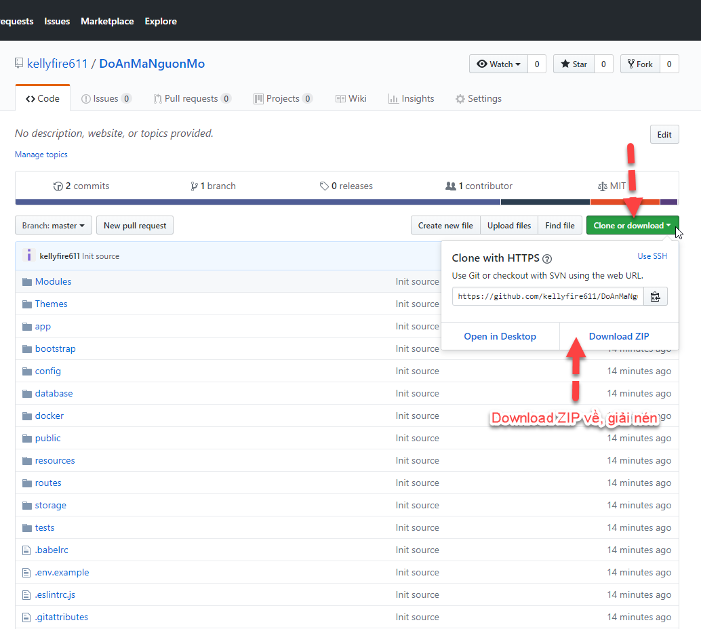

# DoAnMaNguonMo
Đồ án Mã nguồn mở Thầy Nghị. Lý do chọn source:
- Đây là CMS được viết bằng Laravel, có đầy đủ các chức năng:
    - Backend, Frontend
    - Quản lý (Thêm, Sửa, Xóa) các Trang
    - Quản lý Menu
    - Quản lý Tag
    - Phân theo từng Module hoạt động
    - Có phần Setting tùy theo môi trường
    - Có quản lý Người dùng, Phân quyền đầy đủ
    - Có Quản lý luôn phần Đa phương tiện (Media, Upload, Download...)
    - Hỗ trợ Đa ngôn ngữ (do mình làm trang Quản bá Du lịch, nên cần Đa ngôn ngữ Anh Việt, ...)

- Chức năng cho phép Đăng Quảng cáo (theo kiểu banner)
- Chức năng Tìm kiếm

# Cách chạy source
## Cần có các chương trình sau:
- PHP 7+
- Composer (https://getcomposer.org/Composer-Setup.exe)
- IDE có thể xài bất kỳ. Gợi ý: Visual Studio Code (https://code.visualstudio.com/)
- Git for windows (https://git-scm.com/download/win)

#Minimum System Requirements
PHP 7.0 or higher
PDO PHP Extension
cURL PHP Extension
OpenSSL PHP Extension
Mbstring PHP Extension
Tokenizer PHP Extension
Mcrypt PHP Extension
GD PHP Library
MySql 5.5
One of the following cache drivers: memcached, redis, apc. (defaults to array)

## Download hoặc Clone source về
### Download
- Vào web https://github.com/kellyfire611/DoAnMaNguonMo
- Chọn download như hình:



### Clone source
- Chạy câu lệnh sau để get source mới nhất từ GitHub về:
```
git clone https://github.com/kellyfire611/DoAnMaNguonMo.git
```

## Restore database
Chạy file script `db/db_doanmanguonmo_20190304.sql` để tạo database

## Cấu hình
- Hiệu chỉnh file `.env` với các thông số kết nối DB máy của mỗi người. Hiện tại là MySql, sẽ tìm cách chỉnh về MongoDB sau ;)
```
DB_CONNECTION=mysql
DB_HOST=127.0.0.1
DB_PORT=3306
DB_DATABASE=doanmanguonmo
DB_USERNAME=root
DB_PASSWORD=root
```

## Chạy web
Chạy câu lệnh sau:
```
php artisan serve
```
Mở web với đường dẫn http://localhost:8000/en/backend/

## Tài khoản Admin
Tài khoản truy cập mặc định là: `admin@admin.com.vn/123456`

# Cách code Backend
[Backend](backend.md)

# Cách code Frontend
[Frontend](frontend.md)